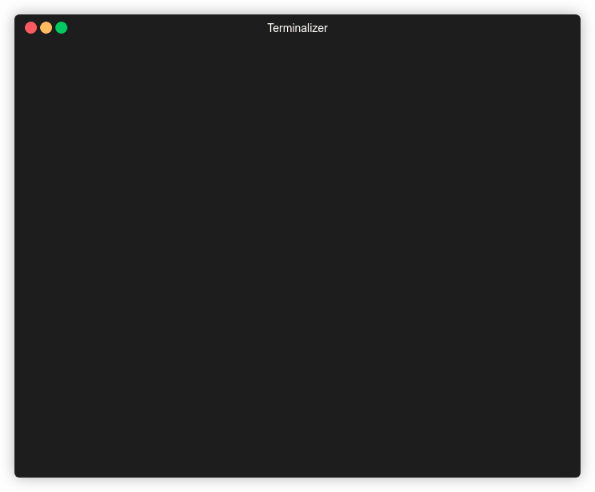

# PythonBotnet (C&C)

Simple Command and Control (C&C) botnet written asynchronously using asyncio
in Python3.7. Communication is implemented using unencrypted websockets.

### Features

* Run bash command on multiple bot clients simultaneously
* Enable reverse-shell on a specific bot client
* Bot client authentication using password

*See [planned features](#to-be-done)*

### Example




### Why?

Developed as a part of an assignment in CTU class Introduction to Security

## Getting started

### Run via docker-compose

*Required: [docker](https://www.docker.com/), [docker-compose](https://docs.docker.com/compose/)*


The easiest way to test the botnet is to run prepared 
[docker-compose.yml](docker-compose.yml) file. To build images and run 
docker-compose in detached mode:
```
$ docker-compose build
$ docker-compose up -d
```

To connect to the control panel, websocket cli client is needed (e.g. 
[wscat](https://www.npmjs.com/package/wscat))
```
$ wscat -c localhost:6767
Connected (press CTRL+C to quit)
< Enter: 
* "0" - to print bot clients collection
* Indexes of clients separated by space to send bash command to
* Index of one client to jump into bash (send "exit" for termination)

>
```


### Run locally

Project can be also installed locally:
```
$ pip install . 
```

Then run control panel server, bot client and websocket cli client in separated 
 terminals:

```
$ python3.7 src/server.py
$ python3.7 src/client.py
$ wscat -c localhost:6767
...
```

### Configuration

#### Control panel server
```
$ python3.7 server.py --help
Usage: server.py [OPTIONS]

Options:
  -cp, --cac_port INTEGER     Port where command and control center listens
  -bp, --bot_port INTEGER     Port where bots should connect in order to join
                              the botnet
  -s, --secret_password TEXT  Password needed for bots to connect
  -i, --ip_address TEXT       Ip address for server to listen on
  --help                      Show this message and exit.
```

#### Botnet client
```
$ python3.7 client.py --help
Usage: client.py [OPTIONS]

Options:
  -s, --server_address TEXT       Ip address or host of a running c&c
  -p, --port INTEGER              Port where the running c&c listens
  -i, --connection_interval INTEGER
                                  Interval in seconds in which client tries to
                                  connect to c&c server
  --help                          Show this message and exit.
```
*Note: password for client authentication needs to be written directly to 
[src/client.py](src/client.py). (Default values match)*

## To be done:

#### New features:
* Encrypt the websocket communication using TLS
* Add option to provide configuration in file
    * Log into file
    * Tls keys for encrypted communication
    * Ports
    * ...
* Make client less dependant on 3rd party libraries 
* Add option for domain generating algorithms
* Prettify the CLI view

#### Issues to be solved:
* reverse shell freezes when interactive command as `htop` or `ping` is executed

## License
This project is licensed under the terms of the MIT license.